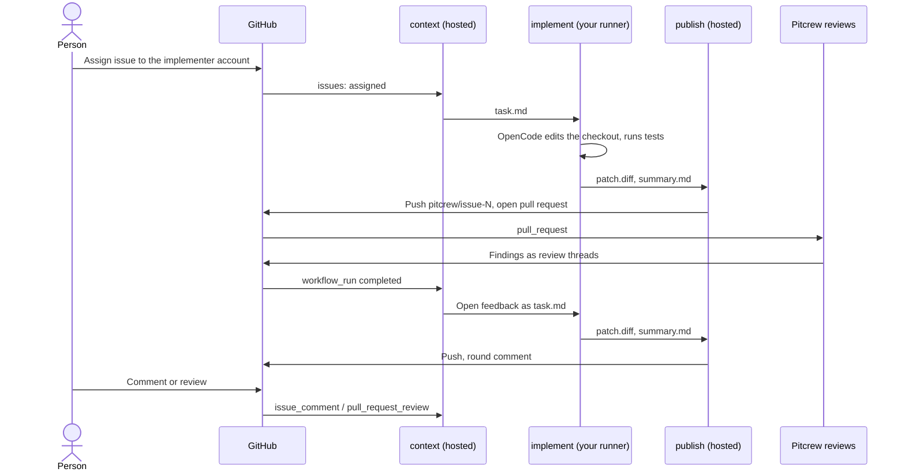

# Issue implementer (labs)

An experiment. It is not part of a PR Pitcrew release, and `package.json` does not ship it.

Assign an issue to the implementer account. The agent implements the issue on a runner of your
own, with a model of your own, and opens a pull request. Then it addresses the comments on that
pull request: yours, and the findings of the Pitcrew review agents.

[TOC]

## How it works



The workflow has three jobs in two lanes, as [ADR 7](../../docs/adr/0007-what-is-deliberately-not-in-the-first-release.md) requires for agents that write:

| Job | Runner | Holds | Does |
| --- | --- | --- | --- |
| `context` | hosted | workflow token (read, comment) | Decides if there is work. Writes `task.md`. |
| `implement` | yours | model key, `contents: read` | Runs the agent. Hands on a patch and a summary. |
| `publish` | hosted | write token, no model key | Checks and applies the patch. Pushes. Comments. |

The agent has a shell. Thus the job that runs it holds no token that can write. The job that can
write reads two files and runs no code from the agent's branch. Its scripts come from
`deyai-labs/pr-pitcrew` at `harness-ref`.

### Rounds

Every event only wakes the workflow up. The `context` job then reads the pull request and collects
the open feedback:

- Comments and review texts from `OWNER`, `MEMBER` or `COLLABORATOR`.
- Unresolved, not outdated review threads with a new comment from such a person, or a new Pitcrew
  finding.
- Comments that start with `/` (for example `/review`) are not feedback.

A round comment from the implementer records a snapshot time. Feedback after that time is open.
Feedback written during a round goes into the next round.

A round that runs out of time pushes what it has. Its comment repeats the previous snapshot, so its
feedback stays open, and the comment wakes the next round to continue.

Rounds that run without a person asking (only review findings, or a round that ran out of time)
stop after `max-auto-rounds` (default 3) in a row. The implementer then posts one notice. A comment
from a person starts the next round.

The agent's summary goes into comments, but without HTML comments. Only the last round marker in a
comment counts, and the script writes it after the summary.

A failed round posts a notice with the workflow token. That notice wakes nothing, so a failure
does not repeat without end. The feedback stays open for the next wake-up.

### Limits of the agent

| Can | Cannot |
| --- | --- |
| Read and edit the checkout | Commit or push |
| Run shell commands, for example `npm test` | Change `.github/workflows/` (publish refuses the patch) |
| Reach the model endpoint and the internet (runner firewall) | Use `webfetch` or `websearch` |
| | Ask questions (`question`, `doom_loop` and `external_directory` are denied, so CI never waits) |

The profile is [`profile.json`](profile.json). It is not in `profiles/`, because every profile there
limits writing to `.pitcrew-run/`.

## Setup

Run it only in a **private** repository. The agent runs a shell on your runner. In a public
repository, fork pull requests can reach self-hosted runners.

1. Copy [`caller.yml`](caller.yml) to `.github/workflows/issue-implementer.yml` in the repository.
   Put the `name:` of your review workflows into `workflow_run.workflows`.
2. Give the implementer account write access to the repository.
3. Set the repository variables and secrets below.
4. Merge the workflow to the default branch. `issues` and `workflow_run` use only that version.

| Name | Kind | Required | Value |
| --- | --- | --- | --- |
| `PITCREW_IMPLEMENTER_ASSIGNEE` | variable | yes | Login of the implementer account, for example `robyed-bot`. |
| `PITCREW_IMPLEMENTER_BASE_URL` | variable | yes | OpenAI-compatible endpoint, for example `http://100.120.146.19:1234/v1`. |
| `PITCREW_IMPLEMENTER_MODEL` | variable | yes | Model id, for example `qwen/qwen3.8-27b`. |
| `PITCREW_IMPLEMENTER_CONTEXT_LIMIT` | variable | recommended | Context length the endpoint has loaded, in tokens. OpenCode compacts the session before it overflows. |
| `PITCREW_IMPLEMENTER_OUTPUT_LIMIT` | variable | no | Maximum output tokens. Default: a quarter of the context, at most 32768. |
| `PITCREW_IMPLEMENTER_API_KEY` | secret | yes | Key for the endpoint. |
| `PITCREW_IMPLEMENTER_PUSH_TOKEN` | secret | one of two | Token of the implementer account: `repo` scope (classic), or a fine-grained token with Contents and Pull requests write. |
| `PITCREW_IMPLEMENTER_APP_ID` | variable | one of two | A GitHub App with Contents, Pull requests and Issues write. Pass its key as `app-private-key`. |

Do not use the workflow token to push. Its pushes start no workflow, so no review would run.

Inputs of the reusable workflow: `runs-on`, `timeout-minutes` (default 180), `reasoning-effort`
(default `high`), `max-auto-rounds` (default 3), `output-language`, `harness-ref` (default `main`).

### Reasoning effort

`reasoning-effort` goes into the generated OpenCode configuration as the model option
`reasoningEffort`. OpenCode sends it to an OpenAI-compatible endpoint as `reasoning_effort`. LM
Studio runs `qwen/qwen3.8-27b` at `low` when the request does not ask for more.

To check what the endpoint does with it, compare the reasoning length of two requests:

```bash
curl -s "$BASE_URL/chat/completions" -H "Authorization: Bearer $KEY" -H 'Content-Type: application/json' -d '{"model":"qwen/qwen3.8-27b","reasoning_effort":"high","messages":[{"role":"user","content":"Is 1001 prime?"}]}'
```

## Use

- **Start:** assign an issue to the implementer account. The issue gets a comment with the run
  link. The work happens on the branch `pitcrew/issue-<number>`.
- **Feedback:** comment on the pull request, review it, or comment on a line. The next round reads
  everything open and answers with one round comment, one line per item (`F1`, `F2`, ...).
- **Start over:** close the pull request, delete the branch, and assign the issue again.

## Known limits

- A local model is slow. A round can take hours, and the runner is busy for that time.
- When the endpoint is not reachable (the laptop sleeps), the round fails with a notice.
- Two review workflows mean two wake-ups per push. The second one can start a second round.
- The implementer does not resolve review threads. A fix that changes the line makes the thread
  outdated. Otherwise, resolve it yourself.
- The agent reads issue text from anybody who can open an issue. Assigning the issue is the
  approval. Read the issue before you assign it.
